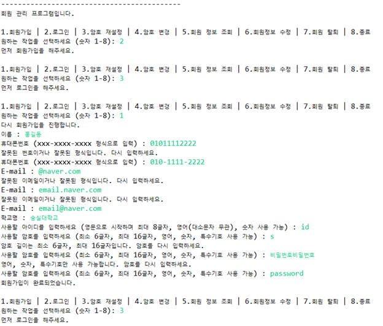
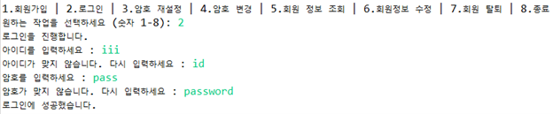
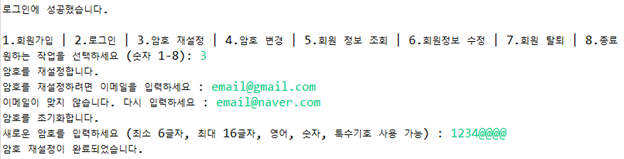
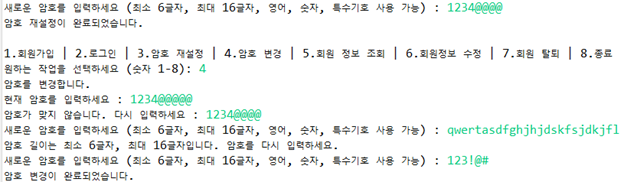
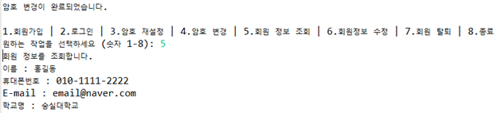
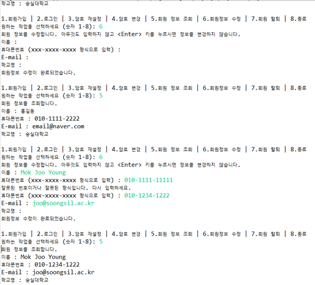
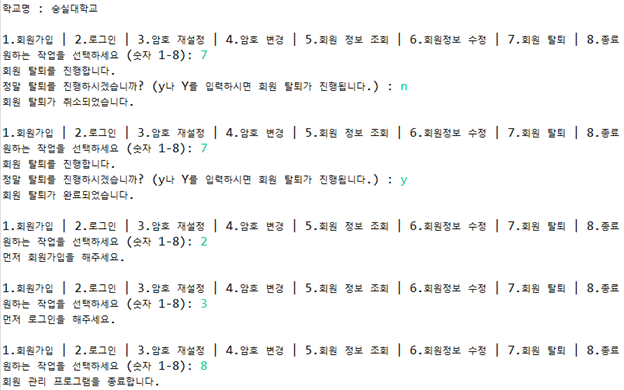

## user-management-system

## 주제: 스프링 프레임워크를 사용한 회원관리 기능 설계 및 구현
2022.04.

## 1. 주요 기능 소개, 동작 설명
-	회원 관리 프로그램의 기능들(회원가입, 로그인, 암호 재설정, 암호 변경, 회원 정보 조회, 회원정보 수정, 회원 탈퇴)을 하나씩 시뮬레이션 후 메뉴 입력이 가능한 회원 관리 프로그램을 실행한다.
-	1~8 사이의 숫자를 콘솔에서 입력 받아 각 숫자에 대응되는 기능을 실행한다.
-	1.회원가입 | 2.로그인 | 3.암호 재설정 | 4.암호 변경 | 5.회원 정보 조회 | 6.회원정보 수정 | 7.회원 탈퇴 | 8.종료
-	입력값이 숫자가 아니거나 1~8 사이의 숫자가 아니라면 경고 메시지를 출력하고 다시 입력 받는다.

(1) 회원가입
-	회원가입을 이미 했다면 경고 메시지를 출력한다.
-	회원가입을 하지 않았다면 이름, 휴대폰번호, 이메일, 학교명, 아이디, 그리고 암호를 콘솔 입력 받는다.
-	휴대폰번호는 정해진 번호 형식에 따라 입력되어야 한다. 첫번째 번호는 010,011,016-019만 가능, 중간 번호는 digit 3-4개, 마지막 번호는 digit 4개만 가능하다.
-	이메일은 영어/숫자 + @ + 영어/숫자 + . + 영어/숫자 + (. + 영어/숫자) 형식으로 입력되어야 한다.
-	아이디는 영문으로 시작하며 최대 8글자, 대소문자 무관하고 영어, 숫자로 이루어져야 한다. (띄어쓰기 불가)
-	암호는 영어, 숫자, 특수기호를 사용할 수 있고 최소 6글자, 최대 16글자로 설정해야 한다. (띄어쓰기 불가)
-	휴대폰번호, 이메일, 아이디, 암호의 형식이 맞지 않는다면 경고 메세지를 출력하고 다시 입력 받는다.
-	회원가입에 성공했을 때 프린트문을 출력한다.

(2) 로그인
-	회원가입을 하지 않았거나 이미 로그인 했다면 경고 메시지를 출력한다.
-	회원가입을 이미 했고, 로그인하지 않은 상태라면 아이디와 암호를 콘솔 입력 받는다.
-	입력한 아이디가 맞지 않다면 경고문을 출력하고 아이디를 다시 입력 받는다.
-	입력한 암호가 맞지 않다면 경고문을 출력하고 암호를 다시 입력 받는다.
-	로그인에 성공했을 때 프린트문 출력 후 회원의 logIn 정보를 true로 만들어준다.

(3) 암호 재설정
-	로그인하지 않은 상태라면 경고 메세지를 출력한다.
-	암호 재설정 전 이메일을 먼저 입력 받는다.
-	입력한 이메일이 맞지 않다면 경고 메세지를 출력하고 이메일을 다시 입력 받는다.
-	입력한 이메일이 맞다면 암호를 초기화하고 형식에 맞는 새로운 암호를 입력 받는다.
-	암호의 형식이 맞지 않는다면 경고 메시지를 출력하고 다시 입력 받는다.
-	암호 재설정에 성공했을 때 프린트문을 출력한다.

(4) 암호 변경
-	로그인하지 않은 상태라면 경고 메시지를 출력한다.
-	암호 변경 전 현재 암호를 먼저 입력 받는다.
-	현재 암호가 맞지 않다면 경고문을 출력하고 다시 입력 받는다.
-	입력한 암호가 맞다면 형식에 맞는 새로운 암호를 입력 받는다.
-	암호의 형식이 맞지 않는다면 경고문을 출력하고 다시 입력 받는다.
-	암호 변경에 성공했을 때 프린트문을 출력한다.

(5) 회원정보 조회
-	로그인하지 않은 상태라면 경고 메시지를 출력한다.
-	주요 회원 정보(이름, 휴대폰번호, 이메일, 학교명)를 출력한다.

(6) 회원정보 수정
-	로그인하지 않은 상태라면 경고 메시지를 출력한다.
-	이름, 휴대폰번호, 이메일, 학교명 순서대로 콘솔 입력 받고 입력 받은 내용으로 각각 수정한다.
-	콘솔에 아무것도 입력하지 않고 <Enter> 키를 누르면 정보를 변경하지 않는다.
-	휴대폰번호, 이메일의 형식이 맞지 않는다면 경고문을 출력하고 다시 입력 받는다.
-	회원정보 수정이 완료되었을 때 프린트문을 출력한다.

(7) 회원탈퇴
-	로그인하지 않은 상태라면 경고 메세지를 출력한다.
-	회원 탈퇴 여부를 묻고 콘솔 입력에 y나 Y가 입력되면 해당 회원의 정보를 삭제한다.
-	콘솔 입력에 y나 Y가 아닌 다른 문자가 입력되면 회원 탈퇴를 취소한다.
-	회원 탈퇴가 완료/취소되었을 때 프린트문을 출력한다.

(8) 종료
-	프로그램을 종료한다는 메시지와 함께 프로그램을 종료한다.

## 2. 주요 클래스에 대한 상세 설명 (클래스 내 멤버변수, 메서드 등)
(1) 회원가입 클래스: SignUp
-	user 객체를 의존 주입했고 해당 의존 주입 객체에 대한 setter가 있다.
-	startSignUp 메서드는 회원가입 기능을 수행하는 메서드이다.
-	SignUp 생성자는 해당 클래스에 대한 설명을 출력한다.

(2) 로그인 클래스: SignIn
-	user 객체를 의존 주입했고 해당 의존 주입 객체에 대한 setter가 있다.
-	startSignIn 메서드는 로그인 기능을 수행하는 메서드이다.
-	SignIn 생성자는 해당 클래스에 대한 설명을 출력한다.

(3) 암호 재설정 클래스: ResetPassword
-	user 객체를 의존 주입했고 해당 의존 주입 객체에 대한 setter가 있다.
-	startResetPassword 메서드는 암호 재설정 기능을 수행하는 메서드이다.
-	ResetPassword 생성자는 해당 클래스에 대한 설명을 출력한다.

(4) 암호 변경 클래스: ChangePassword
-	user 객체를 의존 주입했고 해당 의존 주입 객체에 대한 setter가 있다.
-	startChangePassword 메서드는 암호 변경 기능을 수행하는 메서드이다.
-	ChangePassword 생성자는 해당 클래스에 대한 설명을 출력한다.

(5) 회원정보 조회 클래스: PrintUserInfo
-	user 객체를 의존 주입했고 해당 의존 주입 객체에 대한 setter가 있다.
-	startPrintUserInfo 메서드는 주요 회원 정보(이름, 휴대폰번호, 이메일, 학교명)를 출력하고, startPrintShortUserInfo 메서드는 이름과 이메일만 출력한다.
-	PrintUserInfo 생성자는 해당 클래스에 대한 설명을 출력한다.

(6) 회원정보 수정 클래스: EditUserInfo
-	user 객체를 의존 주입했고 해당 의존 주입 객체에 대한 setter가 있다.
-	startEditUserInfo 메서드는 회원정보 수정 기능을 수행하는 메서드이다.
-	EditUserInfo 생성자는 해당 클래스에 대한 설명을 출력한다.

(7) 회원탈퇴 클래스: DeleteUser
-	user 객체를 의존 주입했고 해당 의존 주입 객체에 대한 setter가 있다.
-	startDeleteUser 메서드는 회원탈퇴 기능을 수행하는 메서드이다.
-	DeleteUser 생성자는 해당 클래스에 대한 설명을 출력한다.

(8) 회원 클래스: User
-	멤버번수는 name, phoneNum, email, school, id, password, logIn 이 있다.
-	name, phoneNum, email, school, id, password은 각각 이름, 핸드폰번호, 이메일, 학교명, 아이디, 암호를 문자열로 받고, logIn은 로그인 여부를 확인할 수 있는 Boolean 변수이다. (true면 로그인 완료, false면 로그인 안한 상태)
-	메서드는 각 멤버변수에 대한 getter와 setter가 있고, 회원탈퇴 시 name, phoneNum, email, school, id, password, logIn 각각의 회원정보를 리셋(문자열 변수는 null로, Boolean 변수는 false로)하는 메서드인 resetUserInfo()가 있다.

(9) 기능들을 어셈블한 회원 관리 프로그램 클래스: UserManagementProgram
-	컴포넌트 스캔과 의존 자동 주입을 사용한 클래스이다.
-	모든 기능들이 들어가 있는 클래스, user, signUp, signIn, resetPassword, changePassword, printUserInfo, editUserInfo, deleteUser 객체를 의존 자동 주입했고 각 의존 주입 객체에 대한 setter가 있다.
-	string2Int 메서드는 입력받은 string을 int로 바꿔주고 리턴한다. 입력값이 정수가 아니라면 NumberFormatException을 실행한다.
-	chooseProgram 메서드는 메뉴 입력이 가능한 회원 관리 프로그램이 구현된 메서드이다. 1-8 사이의 정수를 콘솔에서 입력 받아 각 숫자에 대응되는 기능을 실행한다. 입력값이 정수가 아니라면 exception을 실행, 경고 메세지를 출력하고, num을 0으로 설정해 정수를 다시 입력할 수 있게 한다. 입력값이 1-8 사이의 정수가 아니어도 경고 메세지를 출력하고 마찬가지로 숫자를 입력받는다. 입력값이 8이 나올 때까지 프로그램을 실행하고 8을 입력하면 프로그램을 종료한다.
-	UserManagementProgram 생성자는 해당 클래스에 대한 설명을 출력한다.

(10) 빈 설정 클래스: AppContext
-	컴포넌트 스캔으로 인해 UserManagementProgram 객체를 주석 처리하였다.
-	printUserInfo1 객체에 Qualifier를 사용해 자동 주입할 빈 객체를 printUserInfo로 지정했다.
-	위 클래스를 모두 포함하고, 위 클래스에 대한 빈 객체를 생성한다.

(11) 메인 클래스: ProgramTest
-	회원 관리 프로그램의 기능들(회원가입, 로그인, 암호 재설정, 암호 변경, 회원 정보 조회, 회원정보 수정, 회원 탈퇴)을 하나씩 시뮬레이션 후 메뉴 입력이 가능한 회원 관리 프로그램을 실행한다.

## 3. 주요 기능에 대한 실행 사례 (회원관리 서비스 사용 시나리오) 
(1) 회원가입 
 

(2) 로그인 
 

(3) 암호 재설정 
 

(4) 암호 변경 
 

(5) 회원 정보 조회 
 

(6) 회원 정보 수정 
 

(7) 회원 탈퇴 및 종료 
 

## 4. 한계점 및 개선 사항
-	데이터베이스나 자바 프로그램의 데이터 구조를 사용하지 않아서 한 명의 회원, 한 개의 아이디, 비밀번호 밖에 관리할 수 없는 것이 이 커스텀 프로그램의 한계이다. 데이터베이스나 자바 데이터 구조를 배워서 프로그램을 개선하고 싶다.
